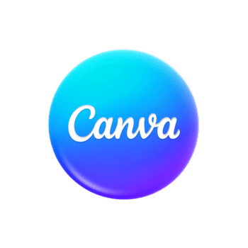
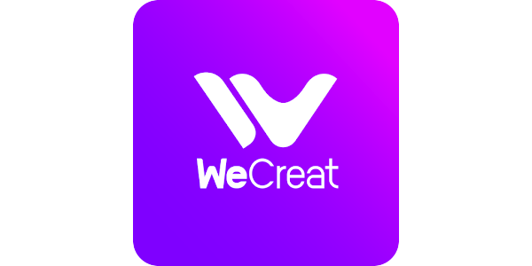
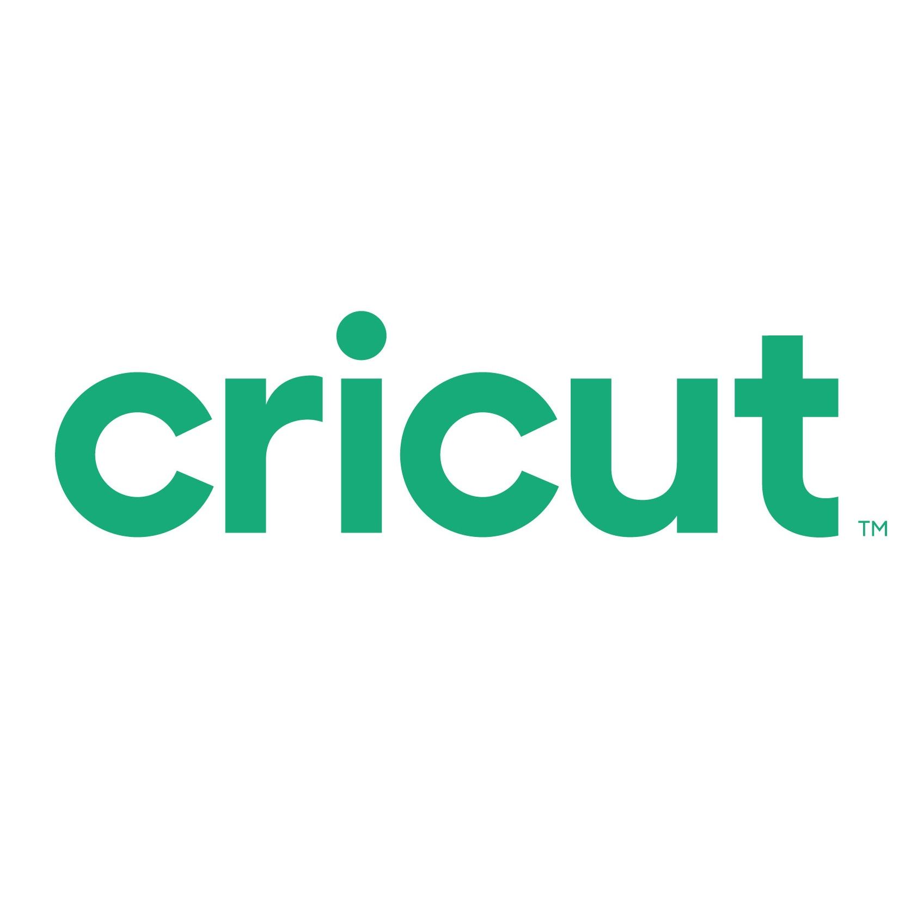
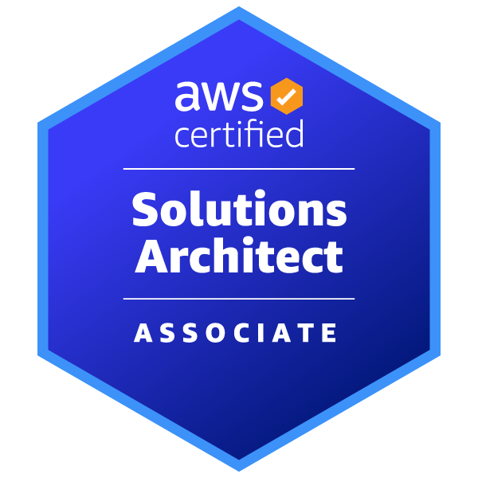
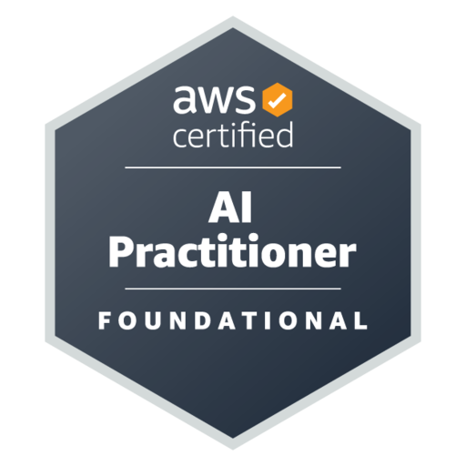

<!-- Polished GitHub Profile README for taylortn -->

<!-- HEAD: Custom Font and Visitor Badge -->
<link rel="preconnect" href="https://fonts.googleapis.com">
<link rel="preconnect" href="https://fonts.gstatic.com" crossorigin>
<link href="https://fonts.googleapis.com/css2?family=BioRhyme:wght@200..800&display=swap" rel="stylesheet">

<!-- TITLE & BANNER -->

 

<!-- TABLE OF CONTENTS -->
<!--
## 📚 Table of Contents

<table width="100%">
<tr>

<td valign="top" width="33%">
  

    <b>👤 About</b>  
    <a href="#about-me">About Me</a> 
    <a href="#contact">Contact</a> 
    <a href="#resume">Resume</a> 
    <a href="#currently-working-on">Currently Working On</a>
  

</td>

<td valign="top" width="33%">
  

    <b>💻 Technical Stack</b>  
    <a href="#cicd-tools">CI/CD Tools</a> 
    <a href="#database-orm-tools">Database | ORM Tools</a> 
    <a href="#design-tools">Design Tools</a> 
    <a href="#frameworks-platforms-libraries">Frameworks, Platforms & Libraries</a> 
    <a href="#hostingsaas">Hosting/SaaS</a> 
    <a href="#infrastructure-tools">Infrastructure Tools</a> 
    <a href="#ide-tools">IDE Tools</a> 
    <a href="#language-framework-tools">Language Framework Tools</a> 
    <a href="#mldl-tools">ML|DL Tools</a> 
    <a href="#server-tools">Server Tools</a> 
    <a href="#other-tools">Other Tools</a> 
    <a href="#certifications">Certifications</a>
  

</td>

<td valign="top" width="33%">
  

    <b> 🚀 Activity</b>  
    <a href="#my-contributions">Contributions</a> 
    <a href="#now-playing">Now Playing</a> 
    <a href="#recent-github-activities">Recent GitHub Activities</a>
  

</td>

</tr>
</table>

-->

<!-- ABOUT ME -->
## 👩🏾‍💻 About Me

 

**System Administrator | Cloud Operations | Security-Focused Infrastructure**

I’m a System Administrator with a strong background in cloud operations and security-focused infrastructure. I work hands-on with Linux systems and AWS environments, making sure everything stays up, secure, and running the way it’s supposed to.

I’ve worked on system monitoring, vulnerability remediation, patching, and handling day-to-day operational support in secure environments. I’m big on keeping systems stable, locked down, and efficient without overcomplicating things.

Right now, I’m focused on leveling up my Linux skills as I prepare for my RHCSA, while continuing to build real-world experience in cloud and system administration.
<!--
### Core Expertise
- 🔐 Cybersecurity Operations: Tenable Nessus Manager, Tenable Security Center, vulnerability remediation, plugin lifecycle management
- ☁️ Cloud Infrastructure: AWS (EC2, S3, VPC, IAM, ALBs), secure network architecture, access governance
- 🛠️ Automation & DevOps: Ansible, Infrastructure as Code, environment patching, deployment pipelines
- 🖥️ Systems Administration: Linux environments, system hardening, troubleshooting, patch management
- 📊 Continuous Monitoring & Security Compliance in controlled environments
-->
I hold certifications, including AWS Solutions Architect – Associate, AWS AI Practitioner, and ServiceNow CSA, and I’m currently preparing for RHCSA (EX200) and ServiceNow CAD.

## 🛠️ Technical Stack

- Linux (RHEL)
- AWS (EC2, S3, IAM, VPC)
- Security Tools (Tenable Security Center, Nessus)
- Automation (Ansible)

## 🚀 Featured Projects

🔹 **Cloud Linux Automation Lab**  
Built an automated AWS-based Linux environment using Terraform and Ansible to provision infrastructure and configure systems. Focused on infrastructure as code, system configuration, and repeatable deployment workflows.

🔗 https://github.com/taylortn/cloud-linux-automation-lab

🔹 **DevSecOps Vulnerability Lab**  
Designed and implemented a vulnerability management workflow using Linux systems and security tools to identify, prioritize, and remediate system vulnerabilities. Simulated real-world patching and remediation processes to improve system security and compliance.

🔗 https://github.com/taylortn/devsecops-vulnerability-lab

🔹  **DevOps CI/CD Pipeline Lab**  
Developed a CI/CD pipeline using GitHub Actions and Docker to automate application build and deployment processes. Focused on streamlining deployments, improving consistency, and reducing manual intervention in development workflows.

🔗 https://github.com/taylortn/devops-cicd-pipeline-lab

<!--## ⚙️ Engineering Focus

• Cloud Infrastructure Automation  
• DevOps CI/CD Pipeline Design  
• Linux Security & Vulnerability Remediation  
• Infrastructure as Code (Terraform)  
• Configuration Management (Ansible)  
• Secure Cloud Operations
-->
## 📄 Resume

[

 
<!-- CURRENT PROJECTS -->

## 🧠 Currently Working On

- Strengthening vulnerability management using Tenable Security Center & Nessus
- Improving system patching and hardening across Linux (RHEL) and Windows environments
- Preparing for RHCSA (EX200)
  
<!-- TOOL SECTIONS (examples below) -->
<!--## 🔁 CI/CD Tools

  
  
  
  
  
  

## 🗃️ Database / ORM Tools

Currently focused on cloud + security automation; database projects incoming Q2.

## 🔐 Vulnerability Management Platforms

  
  
  
  
  

## 🎨 Design Tools

   
  
  
  
  
  
  
  

## 🧩 Frameworks, Platforms & Libraries

  
  

## ☁️ Hosting/SaaS

Cloud Engineer & Security-Focused Infrastructure Specialist building resilient AWS environments.  I specialize in vulnerability management, automation, and system hardening across enterprise platforms.  Focused on secure architecture, continuous improvement, and operational excellence.

  
  
  

-->
<!-- Additional sections omitted for brevity, but would follow the same pattern -->

<!-- CERTIFICATIONS -->
## 📜 Certifications

  
  
  
  

## 📌 Recent GitHub Activity

<!--START_SECTION:activity-->
1. 🔒 Closed issue [#1](https://github.com/taylortn/portfolio/issues/1) in [taylortn/portfolio](https://github.com/taylortn/portfolio)
<!--END_SECTION:activity-->

<!-- CONTRIBUTIONS -->
<!--
## 📈 My Contributions

  

<!-- COMMIT 

name: Full-year calendar
uses: lowlighter/metrics@latest
with:
  filename: metrics.plugin.isocalendar.fullyear.svg
  token: ${{ secrets.METRICS_TOKEN }}
  base: ""
  plugin_isocalendar: yes
  plugin_isocalendar_duration: full-year
-->
<!-- STATS -->
<!--
## 🔥 GitHub Stats

  

-->

